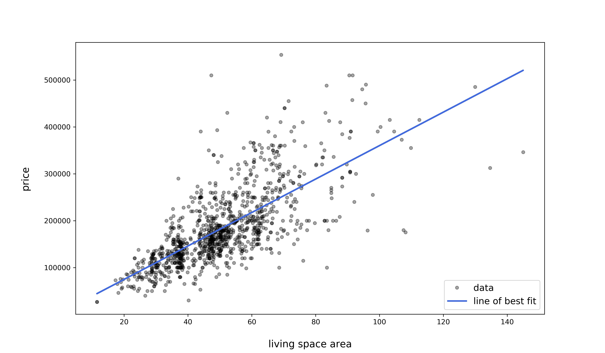

# System Identification

## Requirements
- python 3.6
- matplotlib
- numpy
- scipy
- pandas
## To get started
clone this git repository
## Results
### Least squares
Linear regression for residential premises data (least squares method application).

### Maximum likelihood estimation
### Kernel density estimation
